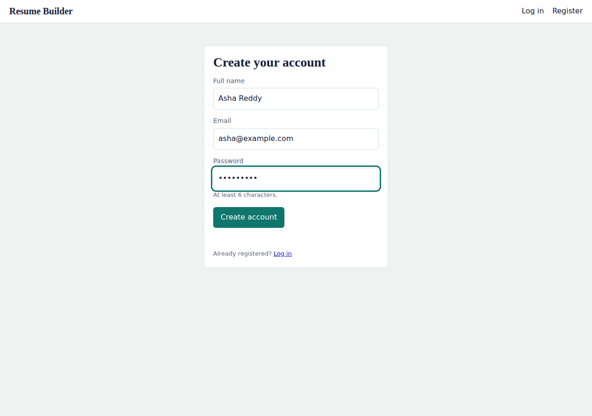
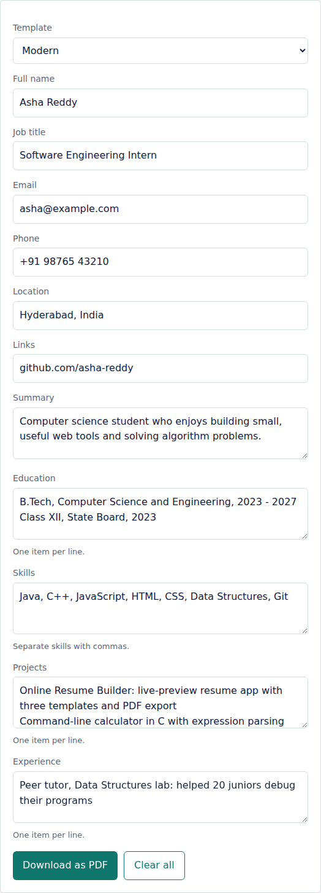
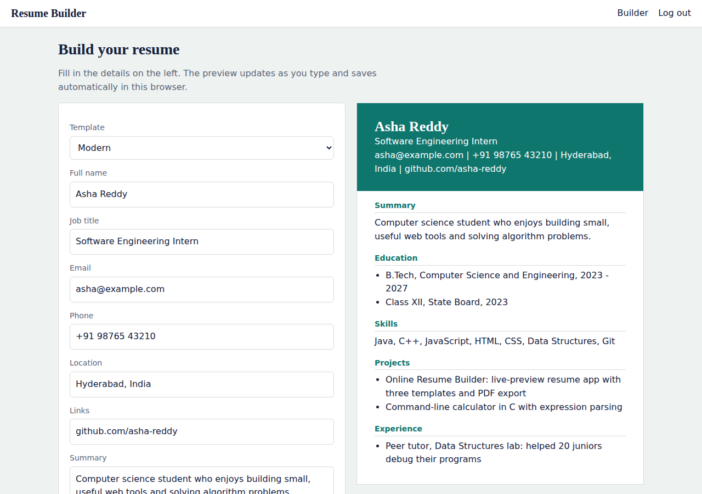

# Online Resume Builder

A simple web app for creating a professional resume in the browser. Register, fill in your details, pick a template, watch the live preview, and download the result as a PDF.

## Features

- Register and log in
- Live resume preview that updates as you type
- Three templates (Classic, Modern, Minimal) you can switch between instantly
- Download as PDF using the browser's print dialog
- Auto-save of your resume in the browser
- Works on phones, tablets and desktops

## Tech stack

- HTML5
- CSS (`style.css`)
- Vanilla JavaScript
- `localStorage` / `sessionStorage` for data (no backend)

## Screenshots

| Registration | Resume details | Dashboard |
|---|---|---|
|  |  |  |

## Getting started

1. Clone the repository
   ```bash
   git clone https://github.com/<your-username>/<your-repo>.git
   cd <your-repo>
   ```
2. Open `register.html` in a browser (or run `python -m http.server` and visit `http://localhost:8000`).
3. Create an account, log in, and start building.

To host it online, enable **Settings > Pages** on GitHub and publish from the `main` branch.

## Project structure

```
index.html          Resume builder and live preview
login.html          Login page
register.html       Registration page
style.css           Styles for all pages (including print layout)
script.js           Shared logic: login, saving, templates, preview
Documentation.md    Detailed project documentation
Dashboard.png       Screenshot: builder page
RegisterationPage.png  Screenshot: registration page
StudentDetails.png  Screenshot: details form with sample data
```

## Limitations

Accounts and resumes are stored only in the visitor's browser. Passwords are hashed with SHA-256, but this is a learning project and not a secure production login system.
